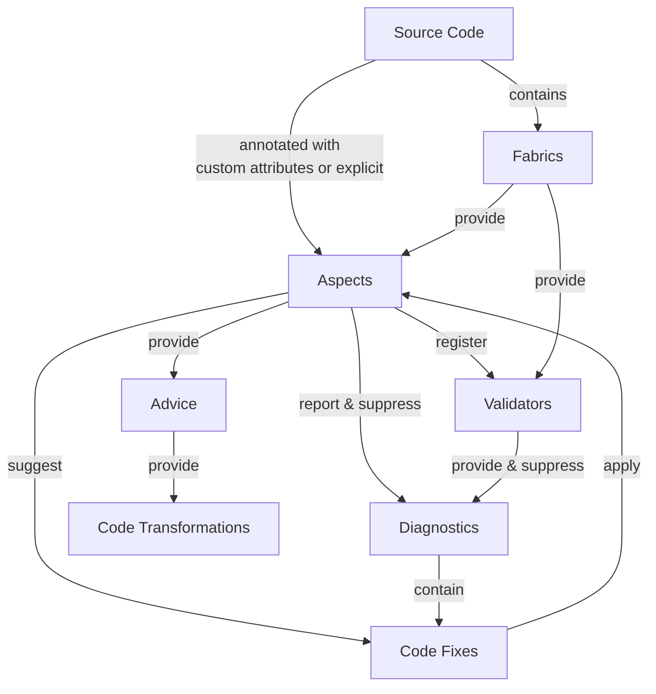

# Metalama architecture

```mermaid
flowchart  TB
    Aspects -- report & suppress --> Diagnostics
    Aspects -- register --> Validators
    Aspects -- suggest --> CodeFixes
    Aspects -- provide --> Advice
    Advice -- provide --> Transformation[Code Transformations]
    SourceCode[Source Code] -- annotated with<br>custom attributes or explicit --> Aspects
    SourceCode -- contains --> Fabrics
    Fabrics -- provide --> Aspects
    Fabrics -- provide --> Validators
    Validators -- provide & suppress--> Diagnostics
    Diagnostics -- contain --> CodeFixes
    CodeFixes[Code Fixes] -- apply --> Aspects
```

> [!div class="see-also"]
> <xref:aspects>
> <xref:fabrics>
> <xref:aspect-design>
> <xref:advising-code>
> <xref:diagnostics>

