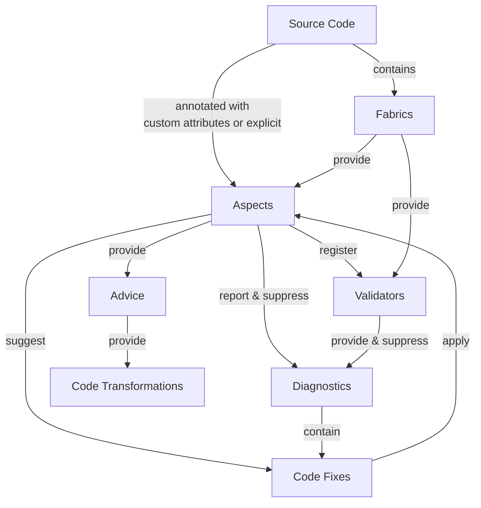

# Metalama architecture

Metalama's architecture connects several core concepts that work together to enable compile-time code transformations and validations. This article provides a high-level overview of how these components interact.

The following diagram illustrates the relationships between Metalama's key architectural components:

## Component overview

**Aspects** are the primary building blocks of Metalama. They're applied to your source code through custom attributes or explicit configuration, and can:

- Report and suppress diagnostics
- Register validators for additional code analysis
- Suggest code fixes to address issues
- Provide advice that generates code transformations

**Fabrics** provide another way to apply aspects and validators. Unlike attribute-based aspects, fabrics exist within your source code and programmatically select which declarations receive aspects or validators.

**Validators** perform code analysis. They can be registered by aspects or provided by fabrics, and they report or suppress diagnostics based on your code's compliance with defined rules.

**Advice** specifies the code transformations to apply. Aspects provide advice, which Metalama uses to generate the actual code transformations.

**Code fixes** are suggested solutions to reported diagnostics. They're contained within diagnostics and can apply aspects to fix issues automatically.

**Diagnostics** are warnings or errors reported by aspects and validators. They can contain code fixes that help developers resolve issues quickly.

> [!div class="see-also"]
> <xref:aspects>
> <xref:fabrics>
> <xref:aspect-design>
> <xref:advising-code>
> <xref:diagnostics>
