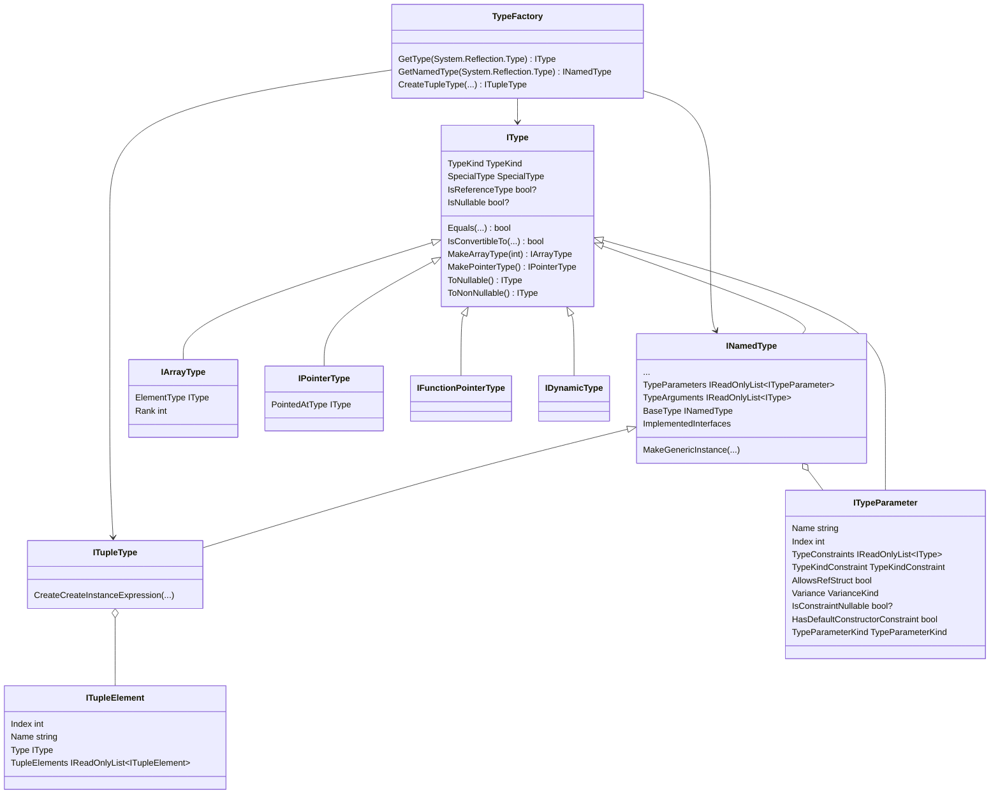

# Working with types

The Metalama type system provides a comprehensive representation of C# types through the <xref:Metalama.Framework.Code.IType> interface and its derived types. This representation is closely aligned with the C# type system and the Roslyn implementation, but may differ from the `System.Reflection` type system. The Metalama type system is designed to work seamlessly with compile-time code analysis and transformation, providing a natural and intuitive API for aspect developers.

## Class diagram



## Kinds of types

The type system in Metalama distinguishes between:

- **Named types** (<xref:Metalama.Framework.Code.INamedType>) - Classes, structs, interfaces, intrinsics like `string` or `void`, etc.
- **Tuple types** (<xref:Metalama.Framework.Code.ITupleType>) - Like `(double X, double Y, double Z)`.
- **Array types** (<xref:Metalama.Framework.Code.Types.IArrayType>) - Like `int[]` or `string[,]`
- **Pointer types** (<xref:Metalama.Framework.Code.Types.IPointerType>) - Like `int*`
- **Type parameters** (<xref:Metalama.Framework.Code.ITypeParameter>) - Generic parameters like `T` in `List<T>`
- **Tuple types** (<xref:Metalama.Framework.Code.ITupleType>) - Like `(int, string)`
- **Function pointers**  (<xref:Metalama.Framework.Code.Types.IFunctionPointerType>) are not fully supported in Metalama.

## Named types

A named type in Metalama is represented by the <xref:Metalama.Framework.Code.INamedType> interface and corresponds to any type that has a name in C#: classes, structs, interfaces, enums, delegates, and records.

Named types are the fundamental building blocks of C# programs. Unlike other types in the type system (such as arrays, pointers, or type parameters), named types:

- Have a fully qualified name (e.g., `System.Collections.Generic.List<T>`).
- Can contain members (methods, properties, indexers, fields, events, constructors).
- Can implement interfaces and inherit from base types.
- Can have nested types.
- Can be generic (with type parameters).

Tuple types, represented by the <xref:Metalama.Framework.Code.INamedType> interface, are also named types.

> [!WARNING]
> Extension blocks (<xref:Metalama.Framework.Code.IExtensionBlock>), despite implementing <xref:Metalama.Framework.Code.INamedType> interface, are not types.

### Examples of named types

```csharp
// Classes
public class Customer;
public record Person(string Name, int Age);

// Structs
public struct Point;
public record struct Point( float X, float Y );

// Interfaces
public interface IRepository;

// Enums
public enum Status;

// Delegates
public delegate void EventHandler();

// Generic types
public class List<T>;

// Nested types
public class Customer
{
    public class Builder;
}

// Tuple types
(string Name, int Age)
```

## Getting an IType object

There are several ways to get an IType instance from your compile-time code.

### From `typeof(.)`

You can use the `TypeFactory.GetType` and `TypeFactory.GetNamedType` methods to map a `System.Type` to the corresponding `IType` or `INamedType`.

```csharp
var stringType = TypeFactory.GetNamedType(typeof(string));
var stringArrayType = TypeFactory.GetType(typeof(string[]));
```

> [!WARNING]
> Metalama does not support the full `System.Type` API at compile time for types that represent run-time types. `typeof` expressions work with run-time types and return an opaque implementation of the `System.Type` abstract type, which does not allow you to use other features of the system reflection API.

### From special types (intrinsics and other)

Some types are identified by a member of the `SpecialType` enum. Using the `TypeFactory.GetType(SpecialType)` method is often more convenient and CPU efficient than using `typeof`.

```csharp
var stringType = TypeFactory.GetType(SpecialType);
```

### From the current project

You can get any type of the current project by querying the `ICompilation` object.

> [!WARNING]
> For best performance, avoid enumerating all types of all namespaces. Instead, whenever possible, navigate the namespaces and select the desired type using the `OfName` method.

```csharp
// From the compilation, in the context of a template
var myType = meta.Target.Compilation
    .GlobalNamespace
    .GetDescendant("My.Namespace")
    .Types
    .OfName( "MyClass" );
```


### Generic types

Generic types in Metalama are represented by types that implement the <xref:Metalama.Framework.Code.IGeneric> interface. Both <xref:Metalama.Framework.Code.INamedType> and <xref:Metalama.Framework.Code.IMethod> implement this interface.

### Generic type definitions

Type parameters are represented by <xref:Metalama.Framework.Code.ITypeParameter>. You can access them through the following collections:

- <xref:Metalama.Framework.Code.IGeneric.TypeParameters?text=IGeneric.TypeParameters> expose the type parameters, i.e. `T` for an instance `List<int>` of the type definition `List<T>`.
- <xref:Metalama.Framework.Code.IGeneric.TypeArguments?text=IGeneric.TypeArguments> expose the type arguments, i.e. the type bound to the arguments, i.e. `int` for an instance `List<int>` of the type definition `List<T>`.

Unlike MSIL, Metalama does not have a concept of "open" generic type with unbound type parameters. Type parameters are always bound to an argument. In generic type definitions, the type parameters are bound to themselves.

Consider the type `List<T>`, where `T` is a type parameter. In the generic type instance `List<int>`, the `T` is the type parameter; `int` is the type argument, and the `T` parameter is bound to `int`. In the type definition `List<T>`, `T` is both the type parameter and the type argument, because `T` is bound to itself.

The `IGeneric` interface exposes the `IsCanonicalGenericInstance` property, which returns `true` if all type parameters are bound to themselves.


### Creating generic instances

Use <xref:Metalama.Framework.Code.INamedType.MakeGenericInstance*> to create a generic type instance from a generic definition:

```csharp
// Get the generic definition of List<T>
var listDefinition = TypeFactory.GetNamedType(typeof(List<>));

// Create List<string>
var stringType = TypeFactory.GetType( SpecialType.String );
var listOfString = listDefinition.MakeGenericInstance( [stringType] );
```

You can also use the following, more compact, syntax:

```csharp
var listOfString = TypeFactory.GetNamedType( typeof(List<>) ).MakeGenericInstance( [typeof(string)] );
``

## Tuple types
It is often convenient to use tuples when an aspect needs to pack all method arguments into a single object. They are an efficient alternative to `object[]`.

Tuple types in Metalama are represented by <xref:Metalama.Framework.Code.ITupleType>, which exposes the tuple elements under the `TupleElements` property. Tuple elements have a type and a name.

In C#, tuple types are syntactic sugar over the `System.ValueType` type. In Metalama, the `System.ValueType` is represented by the `INamedType` interface from which `ITupleType` is derived.

### Creating tuple types

Use <xref:Metalama.Framework.Code.TypeFactory.CreateTupleType*> to create a tuple type.

The following code snippet creates the tuple type `(decimal Quantity, string ProductCode)`:

```csharp
// Create a tuple type from individual types
var tupleType = TypeFactory.CreateTupleType( (typeof(decimal), "Quantity"), (typeof(string), "ProductCode" ) );
```

### Degenerate cases

Metalama handles special cases gracefully:

- **Zero-element tuples**: Returns `ValueTuple.Create()`
- **One-element tuples**: Returns `ValueTuple.Create(value)`
- **Two or more elements**: Uses native tuple syntax `(value1, value2, ...)`

```csharp
// Zero arguments
var emptyTuple = TypeFactory.CreateTupleType(Array.Empty<IType>());
// Result: ValueTuple.Create()

// One argument
var singleTuple = TypeFactory.CreateTupleType(new[] { intType });
// Result: ValueTuple.Create(42)

// Multiple arguments
var normalTuple = TypeFactory.CreateTupleType(new[] { intType, stringType });
// Result: (42, "Hello")
```

### Example: packing and unpacking arguments into a tuple

The following aspect demonstrates how you can pack all method arguments into a tuple, so that they can be passed as a single object to an interceptor. The tuple is then unpacked into an argument list on the other side of the interceptor.

This example is quite convoluted because of the need to implement a basic interception pattern. You can skip it on first reading if you are just here to learn about the type system and don't want to dive into more complex aspects for now.

Despite the complexity due to the interception scenario, the aspect demonstrates the simplicity of working with tuples. The aspect code does not need to bother about the number of parameters. All details are taken care of by `ITupleType`.

[!metalama-test ~/code/Metalama.Documentation.SampleCode.AspectFramework/TupleInterceptor.cs name="TupleInterceptor"]

## Creating array types

Use the <xref:Metalama.Framework.Code.IType.MakeArrayType*?text=IType.MakeArrayType> method to create an array type from an element type. You can optionally specify the rank (number of dimensions) as a parameter:

```csharp
// Single-dimensional array (rank defaults to 1)
var intType = TypeFactory.GetType(typeof(int));
var intArrayType = intType.MakeArrayType(); // int[]

// Multi-dimensional array
var int2DArrayType = intType.MakeArrayType(2); // int[,]
var int3DArrayType = intType.MakeArrayType(3); // int[,,]
```

The resulting <xref:Metalama.Framework.Code.Types.IArrayType> provides access to the element type and array rank:

```csharp
var arrayType = intType.MakeArrayType(2);
var elementType = arrayType.ElementType; // IType representing int
var rank = arrayType.Rank; // 2
```

## Creating pointer types

Use the <xref:Metalama.Framework.Code.IType.MakePointerType*?text=IType.MakePointerType> method to create a pointer type from an element type. Note that pointers are only valid for unmanaged types:

```csharp
var intType = TypeFactory.GetType(typeof(int));
var intPointerType = intType.MakePointerType(); // int*

// Pointer to pointer
var intPointerPointerType = intPointerType.MakePointerType(); // int**
```

The resulting <xref:Metalama.Framework.Code.Types.IPointerType> provides access to the pointed-to type:

```csharp
var pointerType = intType.MakePointerType();
var pointedType = pointerType.PointedType; // IType representing int
```
