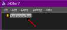
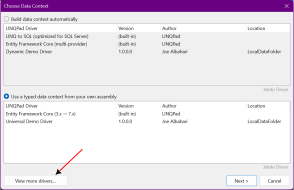
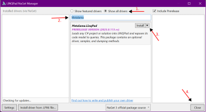
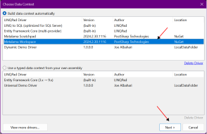
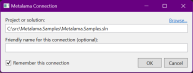
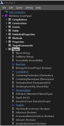

# Inspecting a project using LINQPad

LINQPad is a widely used tool for interactively querying databases using Language Integrated Query (LINQ) syntax. It enables you to write and execute LINQ queries against various data sources, including SQL databases, XML documents, and .NET objects. With the Metalama driver for LINQPad, you can also query your source code like a database.

## Benefits

We developed the Metalama drivers for LINQPad to assist developers and architects in building and testing their Metalama aspects and fabrics. However, this driver can be utilized even if you are not using Metalama.

With this driver, you can:

* Test code queries using the same <xref:Metalama.Framework.Code> API as the one used in aspects and fabrics,
* List the target declarations of aspects,
* Inspect the outcome of aspects, i.e., the output code transformations, diagnostics, or child aspects,
* Query the resulting code mode.

> [!NOTE]
> The Metalama.LinqPad package is [open-source](https://github.com/postsharp/Metalama.LinqPad).

## Installing the Metalama drivers

To install the Metalama driver for LINQPad, follow these steps:

1. In the Explorer tool window, click _Add connection_.

    

2. Click on _View more drivers_.

     

3. In the NuGet LINQPad Manager dialog:

    1. Select _Show all drivers_.
    2. Type _Metalama_.
    3. Select `Metalama.LinqPad` and click _Install_.
    4. Accept a few disclaimers and wait. Then click _Close_.

    

## Opening a project or solution

1. In the Explorer tool window, click _Add connection_.

    

    As you can see, there are _two_ Metalama drivers:

    * _Metalama Workspace_ is bound to a .NET project or solution, which is accessible through the `workspace` variable.
    * _Metalama Scratchpad_ is not bound to anything, so you need your project or solution manually.

2. Choose the _Metalama Workspace_ or _Metalama Scratchpad_ driver and click _Next_.

    

3. If you have chosen _Metalama Workspace_, specify the path to the C# project or solution, then click _Ok_.

    

> [!WARNING]
> The version of the `Metalama.LinqPad` driver must be __higher or equal__ to the version of the `Metalama.Framework` package used in projects.

## Querying source code

Upon adding a C# project or solution to LINQPad, you should see the following structure:

   

The root object, accessible through the `workspace` variable, allows you to query the entire workspace in a single query, i.e., _all_ projects for _all_ target frameworks.

To see all projects loaded in the workspace, use the `workspace.Projects` expression.

The `workspace` object exposes the <xref:Metalama.Framework.Workspaces.IProjectSet> interface. It has the following properties:

* The <xref:Metalama.Framework.Workspaces.IProjectSet.SourceCode?text=workspace.SourceCode> expression gives you access to the _source_ code of the workspace, _before_ Metalama is executed. For instance, `workspace.SourceCode.Types` is the list of all types in the workspace.

    > [!NOTE]
    > If your projects target multiple frameworks, the same declarations will appear multiple times in the queries -- once per target framework.

* The <xref:Metalama.Framework.Workspaces.IProjectSet.TransformedCode?text=workspace.TransformedCode> object represents the code _after_ Metalama is executed, typically with introduced declarations.

* The <xref:Metalama.Framework.Introspection.IIntrospectionCompilationDetails.Diagnostics?text=workspace.Diagnostics> collection lists errors, warnings, and other messages reported by the C# compiler, Metalama, or any aspect.

* The <xref:Metalama.Framework.Introspection.IIntrospectionCompilationDetails.AspectClasses>, <xref:Metalama.Framework.Introspection.IIntrospectionCompilationDetails.AspectLayers>, <xref:Metalama.Framework.Introspection.IIntrospectionCompilationDetails.AspectInstances>, <xref:Metalama.Framework.Introspection.IIntrospectionCompilationDetails.Advice>, and <xref:Metalama.Framework.Introspection.IIntrospectionCompilationDetails.Transformations> collections expose the different steps of the Metalama pipeline.

For more about the code model, see the <xref:Metalama.Framework.Workspaces> and <xref:Metalama.Framework.Introspection> namespaces.

## Filtering projects

As mentioned above, the `workspace` object gives a unified view of all projects, which can be confusing in multi-targeted solutions. Here are three solutions when you want to focus on fewer projects.

### Querying a single project

If you want to query a _single_ project, the easiest approach is to use the <xref:Metalama.Framework.Workspaces.IProjectSet.GetProject*> method, and pass the project name without extension as a parameter. This method returns an object implementing the same <xref:Metalama.Framework.Workspaces.IProjectSet> interface.

For instance, this gives the set of static fields in the `CodeQualityTalk` project:

```csharp
workspace
  .GetProject(@"CodeQualityTalk")
  .SourceCode
  .Fields
  .Where( f => f.IsStatic )
```

### Getting a project subset

To work on multiple projects, you can use the <xref:Metalama.Framework.Workspaces.IProjectSet.GetSubset*> method and supply a predicate that filters the projects.

For instance, this selects the static fields in all projects targeting .NET Standard 2.0:

```csharp
workspace
  .GetSubset( p => p.TargetFramework == "netstandard2.0" )
  .SourceCode
  .Fields
  .Where( f => f.IsStatic )
```

### Filtering projects in the workspace

Another approach is to apply the filters directly to the `workspace` object, which is mutable. You can use the <xref:Metalama.Framework.Workspaces.Workspace.ApplyFilter*> and <xref:Metalama.Framework.Workspaces.Workspace.ClearFilters> methods.

```cs
workspace.ApplyFilter( p => p.TargetFramework == "netstandard2.0" );
workspace.SourceCode.Types.Dump();
```

# Permalinks

In the data grid view, you will see that all declarations have a _permalink_ column. Clicking on this link will open a new query that directly evaluates to this declaration, using the <xref:Metalama.Framework.Code.SerializableDeclarationId> to uniquely identify declarations.

For instance, this is the permalink for the field `_diagnosticDescriptor` in the `FactoryNameAnalyzer` type of the `CodeQualityTalk.Analyzers` project.

```cs
workspace.GetDeclaration(
  "CodeQualityTalk.Analyzers",
  "netstandard2.0",
  "F:CodeQualityTalk.Analyzers.FactoryNameAnalyzer._diagnosticDescriptor",
  false);
```

## Inspecting code references

You can query _inbound_ and _outbound_ references of any declaration using the <xref:Metalama.Framework.Workspaces.DeclarationExtensions.GetInboundReferences*> and <xref:Metalama.Framework.Workspaces.DeclarationExtensions.GetOutboundReferences*> methods.

* Inbound references are references _to_ the current declaration,
* Outbound references are references _from_ the current declaration.

For instance, the following snippet gets all methods and constructors referencing the field, identified by its permalink.

```csharp
var field = workspace.GetDeclaration(
   "CodeQualityTalk.Analyzers", 
   "netstandard2.0", 
   "F:CodeQualityTalk.Analyzers.FactoryNameAnalyzer._diagnosticDescriptor", 
   false);

field.GetInboundReferences().Dump();
```


## Metalama Scratchpad: specifying the project name in the query

Instead of using the _Metalama Workspace_ driver, which requires you to specify the C# project or solution in the connection configuration, you can use the _Metalama Scratchpad_ driver.

The _Metalama Scratchpad_ driver does not require you to specify any project in the connection. Therefore, you must define the `workspace` variable yourself.

Typically, you will start your query with the <xref:Metalama.Framework.Workspaces.WorkspaceCollection> class, then get the <xref:Metalama.Framework.Workspaces.WorkspaceCollection.Default> property and call the <xref:Metalama.Framework.Workspaces.WorkspaceCollection.Load*> method to load your project or solution.

For instance, the following code defines the `workspace` variable and gives it an identical meaning to if you were using the driver:

```cs
var workspace = WorkspaceCollection.Default
       .Load(@"C:\src\Metalama.Samples\examples\log\log-3\Metalama.Samples.Log3.csproj");
```

## Querying code _without_ LINQPad

If you want to run a Metalama query from a different application than LINQPad, you must start by adding a reference to the `Metalama.Framework.Workspaces` package.

Then, you can write code just as if you were coding with the _Metalama Scratchpad_ driver in LINQPad.

You can take [this demo project on GitHub](https://github.com/gfraiteur/CodeQualityTalk/tree/main/CodeQualityTalk.Verifier) as an example.


> [!div class="see-also"]
> <xref:Metalama.Framework.Workspaces>
> <xref:Metalama.Framework.Introspection>

  
