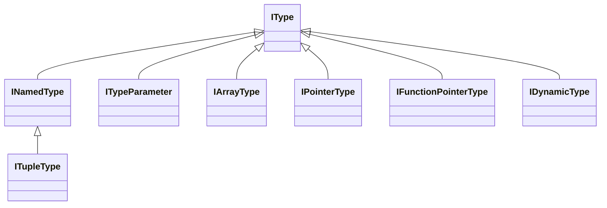

This namespace contains specializations of the <xref:Metalama.Framework.Code.IType> interface.

## Simplified class diagram

> [!WARNING]
> <xref:Metalama.Framework.Code.IExtensionBlock>, despite implementing <xref:Metalama.Framework.Code.INamedType>, should never be used as an <xref:Metalama.Framework.Code.IType>.
