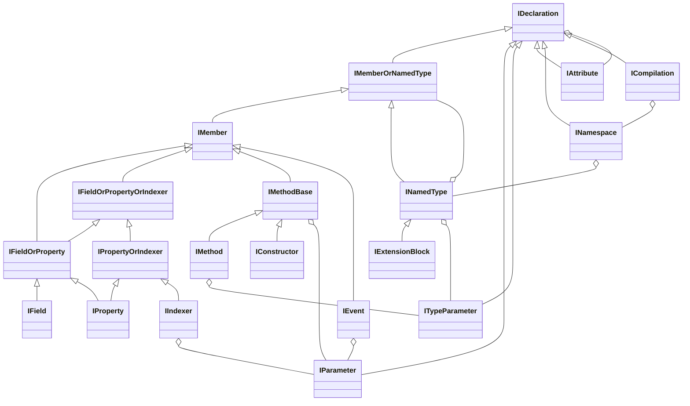

This namespace represents the structure of the source code.

## Simplified class diagram

```mermaid
classDiagram
      IDeclaration <|-- IMemberOrNamedType
      IMemberOrNamedType <|-- IMember
      IMemberOrNamedType <|-- INamedType
      IMember <|-- IFieldOrProperty
      IMember <|-- IFieldOrPropertyOrIndexer
      IFieldOrPropertyOrIndexer <|-- IFieldOrProperty
      IFieldOrProperty <|-- IField
      IFieldOrProperty <|-- IProperty
      IPropertyOrIndexer <|-- IProperty
      IFieldOrPropertyOrIndexer <|-- IPropertyOrIndexer
      IPropertyOrIndexer <|-- IIndexer
      IMember <|-- IMethodBase
      IMember <|-- IEvent
      IMethodBase <|-- IMethod
      IMethodBase <|-- IConstructor
      IDeclaration <|-- IParameter
      IDeclaration <|-- ITypeParameter
      IDeclaration <|-- IAttribute
      IDeclaration <|-- INamespace
      IDeclaration <|-- ICompilation
      INamedType <|-- IExtensionBlock


      IMethodBase o-- IParameter
      IIndexer o-- IParameter
      IEvent o-- IParameter
      IDeclaration o-- IAttribute
      IMethod o-- ITypeParameter
      INamedType o-- ITypeParameter
      INamedType o-- IMemberOrNamedType
      ICompilation o-- INamespace
      INamespace o-- INamedType
```

