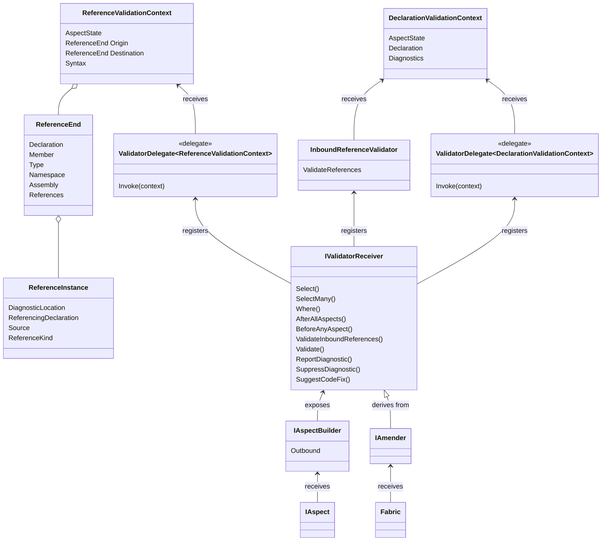

This namespace enables validation of your code, the code that utilizes your aspects, or the code that references the code that uses your aspects.

## Overview

Aspects can register validators from their implementation of <xref:Metalama.Framework.Aspects.IAspect`1.BuildAspect*?text=IAspect.BuildAspect*>, and fabrics from their implementation of <xref:Metalama.Framework.Fabrics.TypeFabric.AmendType*>, <xref:Metalama.Framework.Fabrics.NamespaceFabric.AmendNamespace*> or <xref:Metalama.Framework.Fabrics.ProjectFabric.AmendProject*>.

From these methods, invoke the <xref:Metalama.Framework.Fabrics.IQuery`1.SelectMany*?text=amender.SelectMany> method exposed on the `builder` or `amender` parameter, combined with further calls to <xref:Metalama.Framework.Fabrics.IQuery`1.Where*>, <xref:Metalama.Framework.Fabrics.IQuery`1.Select*> or <xref:Metalama.Framework.Fabrics.IQuery`1.SelectMany*>, then call <xref:Metalama.Extensions.Validation.ValidationQueryExtensions.Validate*> or <xref:Metalama.Extensions.Validation.ReferenceValidationQueryExtensions.ValidateInboundReferences*>. These methods allow you to register a delegate. This delegate is subsequently called and receives a context object of type <xref:Metalama.Extensions.Validation.DeclarationValidationContext> or <xref:Metalama.Extensions.Validation.ReferenceValidationContext>. The delegate can then analyze the code or reference, and report diagnostics.

The <xref:Metalama.Framework.Diagnostics.DiagnosticsQueryExtensions.ReportDiagnostic*>, <xref:Metalama.Framework.Diagnostics.DiagnosticsQueryExtensions.SuppressDiagnostic*> and <xref:Metalama.Extensions.CodeFixes.CodeFixQueryExtensions.SuggestCodeFix*> methods are provided for convenience and utilize <xref:Metalama.Extensions.Validation.ValidationQueryExtensions.Validate*>.

To validate whether an aspect is eligible for a declaration (which involves validating the compilation _before_ the aspect has been applied), implement the <xref:Metalama.Framework.Eligibility.IEligible`1.BuildEligibility*> aspect method.

## Class Diagram

## Namespace Members

